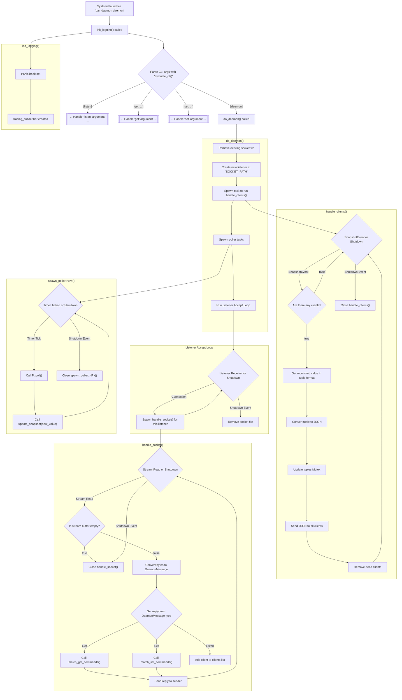

# `bar_daemon` — A Daemon For Status Bars
A daemon that can be queried for specific values, and set values (With notifications for some), can also run as a listener which will be sent all of the values in JSON format whenever a value is updated (Certain values are polled, e.g battery, ram).

Notifies on the change of values, and can be queried for the icon of a particular entry, given its type and value.

Intended for use with a status bar, reduces the amount of values which need to be polled for.

---
<br/>

<div align="center">
  
[bar_daemon](https://aur.archlinux.org/packages/bar_daemon) is available on the Arch User Repository.

It can be installed via `paru -S bar_daemon`, or any other AUR package installation service.

[](https://aur.archlinux.org/packages/bar_daemon)
[](https://aur.archlinux.org/packages/bar_daemon)
</div>

<br/>

## Usage
### Listen for changes/polled values
```
bar_daemon listen
```

### Start daemon
```
bar_daemon daemon
```

### Get Volume Percent
```
bar_daemon get volume percent
bar_daemon get v p
bar_daemon get vol per
```

### Get Battery Time
```
bar_daemon get battery time
bar_daemon get bat time
bar_daemon get bat t
```

### Get Battery Icon
```
bar_daemon get battery icon
bar_daemon get bat i
```

### Set Fan Speed
```
bar_daemon set fan profile Balanced
bar_daemon set fanprofile profile next
bar_daemon set fan p prev
```

### Get All (Responds with an Enum of all the tuples in JSON format)
```
bar_daemon get
bar_daemon get all
```

### More Information
Use `bar_daemon help` or `bar_daemon <COMMAND> help` to get more info about usage

<br/>

## Config
By default the config file is located at `.config/bar_daemon/config.toml`, when the program is first run, if this file doesn't exist, the default config will be copied from `/etc/bar_daemon/config.toml`

### Example Config
``` toml
# Timeout for notification (in milliseconds)
notification_timeout = 1000

# Polling rate for polled values (in milliseconds)
polling_rate = 2000
```

<br/>

## Performance
This daemon is very performance light, The last few outputs of `journalctl` are as follows:

`Consumed 4.181s CPU time over 25min 34.911s wall clock time, 15.7M memory peak.` (0.262% CPU time)

`Consumed 15.332s CPU time over 1h 31min 20.089s wall clock time, 7.2M memory peak.` (0.280% CPU time)

`Consumed 1min 30.738s CPU time over 3h 35min 2.319s wall clock time, 15.8M memory peak.` (0.238% CPU time)

`Consumed 35.898s CPU time over 1h 10min 6.469s wall clock time, 17.6M memory peak.` (0.853% CPU time)


This means that the daemon only uses a few megabytes of memory and a tiny amount of CPU time, so it will not effect system performance in any noticable way.


<br/>

## Process Flow Diagram

### Flow Diagram for `bar_daemon daemon`


<br/><br/>


## Requirements

* `wpctl` (Pipewire) for volume control
* `brightnessctl` for keyboard and monitor brightness control (Devices are set manually in the code)
* `bluetoothctl` for bluetooth control
* `free` for viewing memory usage
* `acpi` for viewing battery stats
* `asusctl` for fan-speed control

